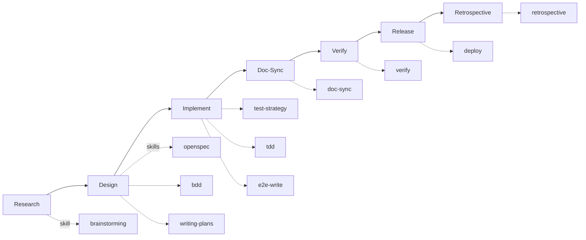

# 开发生命周期总览

> 人类可读流程图。Agent 执行时请加载 `skills/develop-feature/SKILL.md`，不要只读本页。

## 主流程

```
Research → Design → Implement → Doc-Sync → Verify → Release → Retrospective
```



## 测试方法论嵌套

Design → Implement → Verify 贯穿，不另起炉灶：

```
SDD（openspec）→ 验收信号 REQ-x
  └── BDD（bdd）→ 可观察场景 FT-/E2E-
        └── TDD（tdd + test-strategy）→ unit / integration
              └── E2E（e2e-write）+ verify → 真实环境收口
```

## 阻断条件（摘要）

| 阶段 | 不进下一阶段除非… |
|------|------------------|
| Research | 调研报告已输出 |
| Design | spec 含验收信号，用户已确认 |
| Implement | 编译与测试通过，核心逻辑有覆盖 |
| Doc-Sync | 受影响文档已同步（纯内部实现可跳过） |
| Verify | 用户视角验收通过 |
| Release | 验证已通过 |

完整 HARD-GATE 与检查项见 `skills/develop-feature/SKILL.md`。

## 工作类型 → Orchestrator

| 用户意图 | 加载的 skill（非本目录） |
|---------|-------------------------|
| 新功能、完整开发 | `develop-feature` |
| 修 bug、hotfix | `fix-bug` |
| 只讨论方案 | `brainstorming` |
| 只写测试 | `tdd` / `test-strategy` |
| 代码评审 | `code-review` |
| 发布 | `deploy` |
| 复盘 | `retrospective` |

## 旧路径映射（避免重复建设）

| 曾考虑的入口 | 正确映射 |
|-------------|---------|
| `workflows/build-module.md` | `skills/develop-feature/SKILL.md` |
| `workflows/fix-bug.md` | `skills/fix-bug/SKILL.md` |
| `prompts/reviewer.md` | `skills/code-review/SKILL.md` |
| `prompts/auditor.md` | `skills/retrospective/SKILL.md` 或 `writing-skills` |
