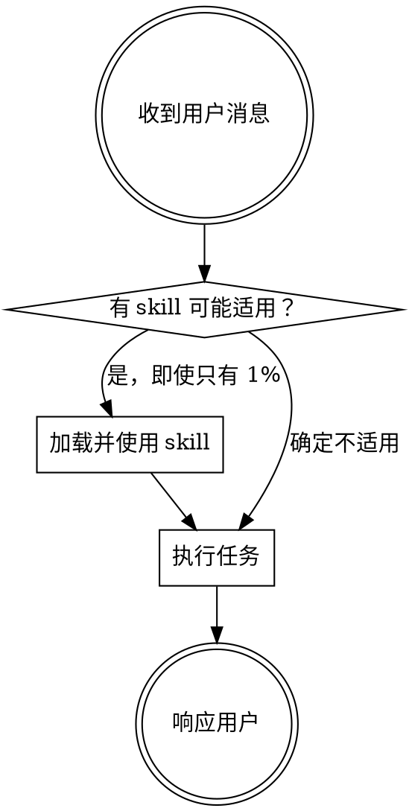

# Bootstrap — P-Skills 会话入口

> 本 skill 在每次会话开始时强制执行，确保所有 skill 能被正确发现和使用。

<EXTREMELY-IMPORTANT>
如果你认为有 1% 的可能性某个 skill 适用于当前任务，你必须加载并使用它。

如果一个 skill 适用于你的任务，你没有选择——必须使用它。

这不是可选的，不是可谈判的，不能找理由跳过。
</EXTREMELY-IMPORTANT>

## 指令优先级

1. **用户明确指令** — 最高优先级
2. **P-Skills skills** — 覆盖默认行为
3. **默认系统提示** — 最低优先级

## 如何找到 Skill

Skill 的安装路径取决于你使用的 agent 和安装方式。**p-skills 不绑定任何 agent**，下表只是常见示例（完整列表见 `INSTALL.md`）：

| Agent | Skill 路径（示例） |
|-------|-----------|
| pi | `~/.pi/agent/skills/` |
| Claude Code | `~/.claude/skills/p-skills/skills/` |
| Cursor | `~/.cursor/skills/p-skills/skills/` |
| Codex | `~/.codex/skills/p-skills/skills/` |
| 通用 / 手动 | `~/.p-skills/skills/` |
| **任何 agent** | 把 `skills/` 目录放到该 agent 的 skill/rules 搜索路径即可 |

每个 skill 是一个目录，包含 `SKILL.md` 入口文件。具体工具名（读文件、执行命令、派 subagent 等）由 agent 自己按 `docs/tools-reference.md` 映射。

### 快速索引

| Skill | 触发条件 |
|-------|---------|
| brainstorming | 设计讨论、方案探索、需求澄清、brainstorming |
| writing-plans | 编写实施计划、拆解任务、writing plans |
| develop-feature | 新需求开发、功能开发、完整开发流程 |
| fix-bug | 修复 bug、故障排查、问题修复、fix bug |
| tdd | TDD、测试驱动、红绿重构、test-driven |
| test-strategy | 测试策略、选择测试层级 |
| verify | 用户验证、验收测试 |
| e2e-write | 编写 E2E 测试 |
| doc-sync | 文档同步、更新文档 |
| doc-validate | 文档校验、一致性检查 |
| deploy | 发布部署、版本发布 |
| retrospective | 回顾总结、复盘、retrospective |
| security-research | 安全调研、安全工具 |
| security-poc | PoC 编写、漏洞验证 |
| security-integrate | 安全工具集成 |
| writing-skills | 创建 skill、编辑 skill、改进 skill |
| subagent-driven-development | 按 plan 实现、subagent 开发 |
| dispatching-parallel-agents | 并行开发、parallel agents |

## 使用规则

### 规则 1：Skill 优先

**在任何响应或行动之前，先检查是否有适用的 skill。** 即使只有 1% 的可能性，也要检查。



### 规则 2：不要找理由跳过

| 想法 | 现实 |
|------|------|
| "这只是简单问题" | 问题也是任务，检查 skill |
| "我需要先了解上下文" | Skill 告诉你如何了解，先检查 |
| "让我先探索代码库" | Skill 告诉你如何探索，先检查 |
| "这个不需要正式流程" | 如果 skill 存在，就用它 |
| "我记得这个 skill" | Skill 会演进，读当前版本 |
| "这个 skill 太重了" | 简单的事会变复杂，用它 |
| "让我先做一件事" | 之前检查 |

### 规则 3：Skill 优先级

当多个 skill 可能适用时：

1. **流程 skill 优先**（brainstorming, fix-bug）— 决定如何处理任务
2. **实现 skill 其次**（tdd, deploy）— 指导具体执行

"我们来建 X" → brainstorming 先，然后实现 skill
"修复这个 bug" → fix-bug 先，然后相关 skill

### 规则 4：Skill 类型

**刚性 skill**（tdd, fix-bug）：严格遵循，不要适配掉纪律

**柔性 skill**（brainstorming, retrospective）：根据上下文调整

Skill 本身会告诉你它是哪种。

## 会话启动检查清单

每次会话开始时：

1. 理解用户意图
2. 根据意图检查适用的 skill
3. 如果适用，加载并遵循 skill
4. 如果不确定，询问用户

## 跨流程强制检查

有些检查项适用于多个流程，不应该硬编码到每个 skill 中。Bootstrap 负责统一 enforcement。

### 代码变更后的文档同步

**触发条件**：当以下 skill 完成代码变更后
- `fix-bug` — Bug 修复
- `develop-feature` — 新功能开发
- `tdd` — 测试驱动开发
- `deploy` — 发布部署

**检查逻辑**：

```
代码变更完成
    ↓
变更是否影响以下内容？
├── API 接口 → 必须同步文档
├── 配置项 → 必须同步文档
├── 依赖 → 必须同步 README
├── 数据模型 → 必须同步文档
└── 纯内部实现 → 可跳过
    ↓
运行 doc-sync skill
```

**执行方式**：

在代码变更 skill 完成后，Bootstrap 自动提醒：

```
⚠️ 检测到代码变更已完成。

请确认是否需要同步文档：
- [ ] API 文档（如有接口变更）
- [ ] README（如有依赖/配置变更）
- [ ] CHANGELOG（记录本次变更）

如需同步，运行 /doc-sync
```

### 测试完成后的验证

**触发条件**：当 `tdd` 或 `e2e-write` 完成后

**检查逻辑**：

```
测试编写完成
    ↓
是否需要用户视角验证？
├── 新功能 → 建议运行 verify
├── Bug 修复 → 建议运行 verify
└── 重构 → 可跳过
```

### 发布前的完整性检查

**触发条件**：当 `deploy` 开始前

**检查清单**：

```
准备发布
    ↓
- [ ] 所有测试通过？
- [ ] 文档已同步？
- [ ] CHANGELOG 已更新？
- [ ] 版本号已更新？
```

## Red Flags — STOP

当你有以下任何想法时，**停下来重新检查**：

- "这只是个简单问题"
- "用户没要求用 skill"
- "我上次已经读过这个 skill"
- "先做一件小事再说"
- "这个任务明显不需要 skill"
- "我记得 skill 说什么"
- "上下文已经够了"

**所有这些都意味着你正在合理化跳过流程。回到 bootstrap 的第一步。**

## Common Rationalizations

| 借口 | 现实 |
|------|------|
| "用户想要快速回答" | 问题也是任务，检查 skill |
| "Skill 太重了" | 简单的事会变复杂，用它 |
| "我记得 skill" | Skill 会演进，读当前版本 |
| "这只是澄清" | 澄清也是任务 |
| "之前检查过了" | 每条消息都重新检查 |

## 参考

- [mattpocock/skills](https://github.com/mattpocock/skills) — Skill 设计灵感
- [obra/superpowers](https://github.com/obra/superpowers) — HARD-GATE 模式
