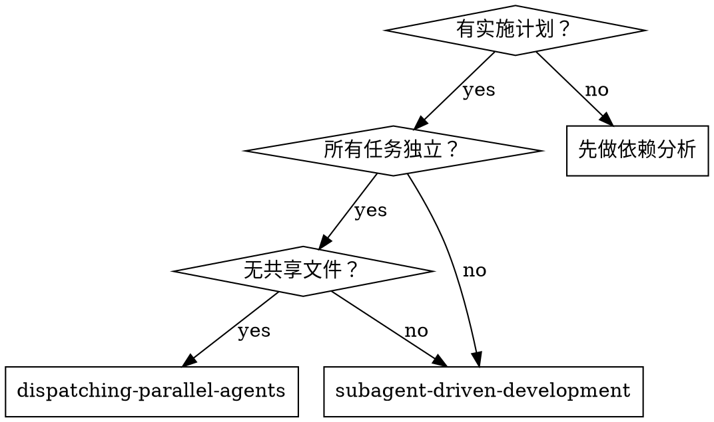
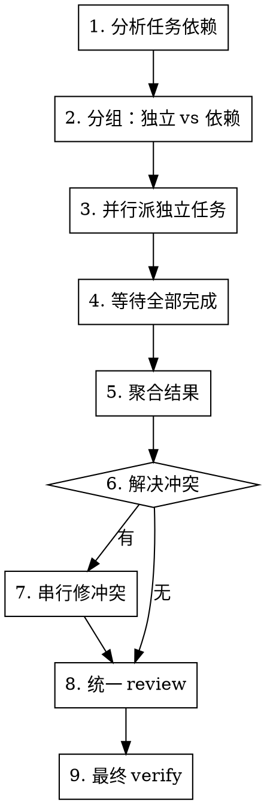

# Dispatching Parallel Agents

> 把独立的计划任务同时派给多个 subagent 并行执行，最后聚合结果并解决冲突。

<HARD-GATE>
**前置条件：**
1. 必须有 approved 的实施计划（先调 `writing-plans`）
2. 计划中必须明确标记**哪些任务是独立的**
3. 独立任务之间**不能有共享文件改动**
</HARD-GATE>

## Overview

**核心原则：** 独立任务并行 = 快；紧耦合任务并行 = 灾难。

**vs. subagent-driven-development：**
- subagent-driven：顺序执行，每个任务后 review
- dispatching-parallel：同时执行多个，最后统一 review

**适用场景：**
- 多个独立模块的功能开发
- 多个不相关的 bug 修复
- 同一功能的多维度实现（前端 + 后端 + 测试）

**不适用场景：**
- 任务间有依赖（A 改了接口，B 要用）
- 任务改同一文件
- 需要 A 的结果才能决定 B 怎么做

## When to Use



## The Process



## Step 1: 依赖分析

**在派任何 subagent 之前**，分析任务之间的依赖：

```markdown
## 任务依赖矩阵

| 任务 | 改的文件 | 依赖 | 被依赖 | 可并行 |
|------|----------|------|--------|:-----:|
| Task A | src/a.ts, tests/a.test.ts | 无 | Task C | ✅ |
| Task B | src/b.ts, tests/b.test.ts | 无 | 无 | ✅ |
| Task C | src/c.ts | Task A | 无 | ❌ |
| Task D | src/d.ts | 无 | 无 | ✅ |

## 并行组
- 组 1（并行）：Task A, Task B, Task D
- 组 2（串行，依赖 A）：Task C
```

**冲突检测：**
- 任何两个任务改同一文件 → 不能并行
- Task A 加新接口，Task B 调用 → 不能并行
- Task A 和 Task B 都改 package.json → 不能并行

## Step 2: 任务分组

把任务分为：

**独立组（可并行）：**
- 每个任务改独立的文件
- 任务间无数据依赖
- 任务间无接口依赖

**依赖组（必须串行）：**
- 有依赖关系的任务
- 改共享文件的任务

## Step 3: 并行派发

对独立组中的每个任务，**同时**派 subagent：

```
[主 agent 一次性发起多个 subagent 调用]
├─ subagent 1: Task A
├─ subagent 2: Task B
└─ subagent 3: Task D
```

**每个 subagent 的 prompt 必须：**
- 完整描述该任务
- 列出该任务**只属于它的文件**（不要让它碰共享文件）
- 明确禁止它做范围外的事
- 告诉它**不要等**其他 subagent

**主 agent 在等待期间：**
- 不要轮询 subagent 状态
- 等待所有 subagent 返回结果
- 不要中途给 subagent 发新指令

## Step 4: 聚合结果

所有 subagent 完成后：

```markdown
## 聚合报告

### Task A (完成)
- 改动：src/a.ts, tests/a.test.ts
- 测试：全部通过
- 提交：abc1234
- 偏离 plan：无

### Task B (完成)
- 改动：src/b.ts, tests/b.test.ts
- 测试：全部通过
- 提交：def5678
- 偏离 plan：无

### Task D (BLOCKED)
- 原因：遇到 [X] 需要决策
- 备选方案：[方案 1] / [方案 2]
```

## Step 5: 解决冲突

如果并行任务产生冲突（罕见，但可能）：

**常见冲突：**
- 两个 subagent 都加了同名函数
- 两个 subagent 改了同一配置文件（应该事前避免）
- 接口命名冲突

**解决方式：**
1. 优先保留与 plan 一致的改动
2. 如果都一致，选更通用的
3. 如果都合理，串行合并

## Step 6: 统一 Review

并行任务完成后，**串行做 review**：

1. 对每个任务单独做 spec review（同 `subagent-driven-development`）
2. 对每个任务单独做 quality review
3. 跨任务 review：检查整体一致性（命名、接口、错误处理）

## Step 7: 最终 Verify

所有 review 通过后，调 `verify` skill 做用户视角验收。

## Subagent Prompt 注意事项

并行 subagent 的 prompt 比顺序 subagent 更严格：

### 必须包含

```markdown
## 隔离边界
- 你只能修改这些文件：[具体列表]
- 你**禁止**修改这些文件：[共享文件列表]
- 你不知道其他并行 subagent 在做什么

## 提交规范
- 提交到分支：[特定分支名]
- commit message 必须包含：[task-id]

## 失败处理
- 如果遇到无法独立解决的问题 → 标记 BLOCKED 并停止
- 不要尝试解决范围外的问题
```

### 禁止

- 不要让 subagent 改共享文件
- 不要让 subagent 等其他 subagent
- 不要让 subagent 决定范围外的事

## Red Flags — STOP

- "这两个任务应该可以并行"（没做依赖分析）
- "改的是同一个文件但改的位置不同"（仍然是冲突）
- "让 subagent 自己协调"（subagent 不知道其他 subagent）
- "先并行了再说，冲突再修"（冲突成本 > 顺序执行）
- "任务独立不独立看感觉"（必须有明确的文件列表证明）

**所有这些都意味着你正在合理化滥用并行。回到依赖分析。**

## Common Rationalizations

| 借口 | 现实 |
|------|------|
| "这两个任务差不多独立" | "差不多独立" = 不独立，必须证明无共享文件 |
| "先并行再修冲突" | 冲突修复成本 > 顺序执行成本 |
| "我脑子清楚，不会冲突" | 你脑子清楚 ≠ 文件不会冲突 |
| "并行快" | 快但有 bug 的并行 < 慢但正确的顺序 |
| "Subagent 可以自己协调" | Subagent 看不到其他 subagent |
| "改同一文件的不同部分就行" | Git 合并会冲突，lint 会冲突，import 会冲突 |

## Verification Checklist

- [ ] 任务依赖矩阵已完成（显式，不是"心里有数"）
- [ ] 并行组中的任务**无共享文件**（有证据）
- [ ] 每个 subagent prompt 明确列出允许/禁止的文件
- [ ] 所有 subagent 并行派出，等待完成
- [ ] 聚合报告已生成
- [ ] 每个任务单独通过 spec + quality review
- [ ] 跨任务一致性已检查
- [ ] 最终 `verify` skill 已运行

## References

- `skills/subagent-driven-development/` — 顺序版本（默认选择）
- `skills/writing-plans/` — 必须先有 plan
- `skills/verify/` — 最后执行
- [obra/superpowers: dispatching-parallel-agents](https://github.com/obra/superpowers/tree/main/skills/dispatching-parallel-agents) — 灵感来源
