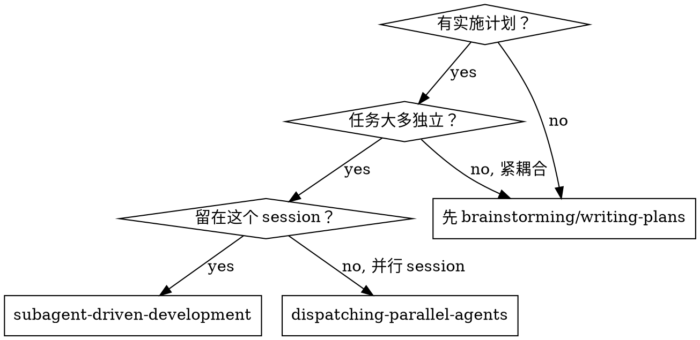
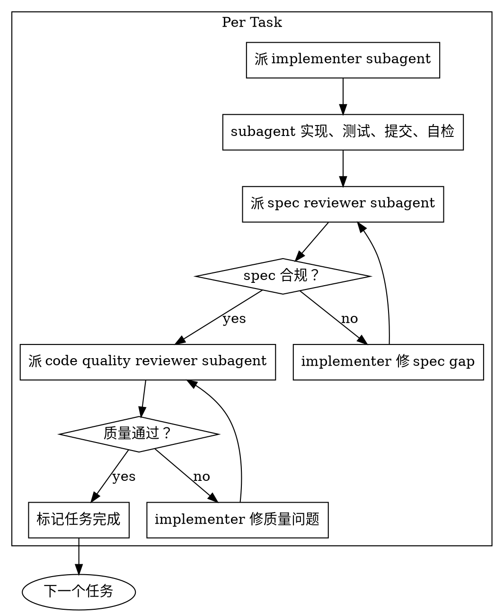

# Subagent-Driven Development

> 把计划拆成任务，每个任务派一个 fresh subagent 完成，每个任务结束后做**双阶段 review**。

<HARD-GATE>
**前置条件：必须先有 approved 的实施计划。**

没有 plan 不要开始。如果还没有 plan，先调 `writing-plans` skill。
</HARD-GATE>

## Overview

**核心原则：** 每个任务派 fresh subagent + 双阶段 review（spec 合规 → 代码质量） = 高质量 + 快速迭代。

**为什么用 subagent：**
- Subagent 的 context 是隔离的，你精心构造它需要的内容
- 不污染主 session 的上下文（保留主 session 做协调）
- 每个任务都能重新开始，不累积历史包袱
- 任何支持 subagent 的 coding agent 都能自主工作数小时不偏离 plan

**持续执行：** 任务间不要停下来询问用户"是否继续"。唯一停止的理由：
- BLOCKED 且你无法解决
- 真正阻止推进的歧义
- 所有任务完成

## When to Use



**vs. dispatching-parallel-agents：**
- 同一 session（无 context 切换）
- 每个任务 fresh subagent（无 context 污染）
- 每个任务后双阶段 review
- 更快迭代（任务间无 human-in-loop）

## The Process



## 每个 Subagent 的职责

### Implementer Subagent

每个任务派一个 fresh implementer，**隔离 context**。给它的 prompt 必须包含：

1. **任务描述** — 来自 plan 的具体步骤
2. **相关文件路径** — 它需要读/改的所有文件
3. **完整代码片段** — 它需要的上下文（不要让 subagent 自己乱找）
4. **验收标准** — 怎么算完成
5. **测试要求** — 必须写的测试
6. **提交规范** — commit message 格式
7. **禁止行为** — 不要做范围外的事

Implementer 的职责：
- 按 plan 实现代码
- 写测试（遵循 `tdd` skill）
- 运行测试，确保通过
- 提交代码（遵循项目 commit 规范）
- 自检（不引入 lint 错误、不破坏既有测试）

### Spec Reviewer Subagent

**在 implementer 完成后立刻派。** 只关心：代码是否匹配 spec。

Spec reviewer 检查：
- 实现是否覆盖 spec 中的所有需求
- 是否有遗漏的边界情况
- 接口是否符合 spec
- 错误处理是否按 spec
- 测试是否验证了 spec 中的所有行为

**Reviewer 不知道代码背后的思考** — 它只看 spec + 代码 diff + 测试。

如果 spec gap：回到 implementer 修复，再次 review。

### Code Quality Reviewer Subagent

**在 spec review 通过后派。** 不关心 spec，只关心代码质量。

Quality reviewer 检查：
- 命名是否清晰
- 是否重复代码
- 是否过度工程
- 是否违反 SOLID / DRY / YAGNI
- 测试是否脆、慢、假
- 错误处理是否健壮
- 是否有安全隐患
- 性能是否有明显问题

如果质量问题：回到 implementer 修复，再次 review。

## Subagent Prompt 模板

### Implementer Prompt

````markdown
你是一个 implementer subagent。你的任务是：

## 任务
[从 plan 复制的任务描述]

## 相关文件
- path/to/file1.ts
- path/to/file2.ts

## 上下文
[需要的代码片段、接口签名、约定等]

## 验收标准
- [ ] 标准 1
- [ ] 标准 2

## 测试要求
- 使用 [框架] 写测试
- 覆盖：正常路径、边界、错误
- 所有测试必须通过

## 提交规范
- commit message 格式：[type]: [description]
- 不要提交无关改动

## 禁止
- 不要重构范围外的代码
- 不要添加未要求的功能
- 不要修改测试框架/CI 配置

完成后：
1. 运行测试并贴输出
2. 列出你做的改动
3. 说明任何偏离 plan 的地方
````

### Spec Reviewer Prompt

````markdown
你是一个 spec reviewer subagent。你只关心：代码是否匹配 spec。

## Spec
[从 plan 复制的验收标准和需求]

## 改动
[implementer 提供的改动清单 + diff]

## 你的任务
逐项检查 spec 中的每条要求是否被满足：

| Spec 要求 | 是否满足 | 证据 |
|-----------|:-------:|------|
| 要求 1 | ✅/❌ | 文件:行号 / 缺失 |

如果有 gap，明确说明：
- 哪个要求未满足
- 期望是什么
- 实际是什么

不要评价代码质量、命名、风格 — 那是 quality reviewer 的事。
````

### Code Quality Reviewer Prompt

````markdown
你是一个 code quality reviewer subagent。你不关心 spec（已经过了），只关心代码质量。

## 改动
[implementer 的改动]

## 检查维度

| 维度 | 状态 | 问题 |
|------|:---:|------|
| 命名清晰度 | ✅/❌ | |
| DRY | ✅/❌ | |
| YAGNI | ✅/❌ | |
| 测试质量（脆/慢/假） | ✅/❌ | |
| 错误处理 | ✅/❌ | |
| 安全隐患 | ✅/❌ | |
| 性能 | ✅/❌ | |

只报告严重问题（critical/high）。小问题（typo、风格）可以放过。
````

## 协调者的职责

作为协调者，你：
1. **按计划顺序派 implementer** — 不要跳任务
2. **派 reviewer 做两阶段 review** — 不要合并
3. **跟踪进度** — 在 TODO 里标记每个任务状态
4. **在 BLOCKED 时介入** — 解决歧义、向用户求助
5. **在全部完成后做最终 verify** — 调 `verify` skill

**禁止：**
- 自己实现任务（你是协调者，不是 implementer）
- 跳过 review（即使任务"看起来简单"）
- 合并两个任务到一个 subagent
- 让 subagent 继承你的 session context

## Red Flags — STOP

- "这个任务太简单不用 subagent"
- "我已经写了，让 subagent 复核就行"
- "两个 review 合并一下"
- "跳过 spec review 直接 quality review"
- "让 subagent 继承我的 context 更高效"
- "任务间问下用户要不要继续"

**所有这些都意味着你正在合理化绕过 subagent 模式。回到第一步。**

## Common Rationalizations

| 借口 | 现实 |
|------|------|
| "这个任务太简单" | 简单任务也可能翻车，subagent + review 就是防这个 |
| "我已经写了代码" | 你写的 = 没隔离 = 没独立验证 |
| "两个 review 太浪费" | spec + quality 是不同维度，合并 = 漏检 |
| "Context 继承更高效" | 高效 = 污染，subagent 需要 fresh context |
| "用户会不会觉得我慢" | 用户要的是正确，不是快 |
| "任务间要汇报进度" | 进度汇报浪费 token，完成后一次汇报 |

## Verification Checklist

- [ ] 所有任务按 plan 顺序执行
- [ ] 每个任务都有 fresh implementer subagent
- [ ] 每个任务都通过 spec review
- [ ] 每个任务都通过 quality review
- [ ] 所有测试通过
- [ ] 所有提交符合规范
- [ ] 最终运行 `verify` skill 做用户视角验收

## References

- `skills/writing-plans/` — 必须先有 plan
- `skills/tdd/` — implementer 必须遵循
- `skills/verify/` — 全部完成后执行
- `skills/dispatching-parallel-agents/` — 并行版本
- [obra/superpowers: subagent-driven-development](https://github.com/obra/superpowers/tree/main/skills/subagent-driven-development) — 灵感来源
